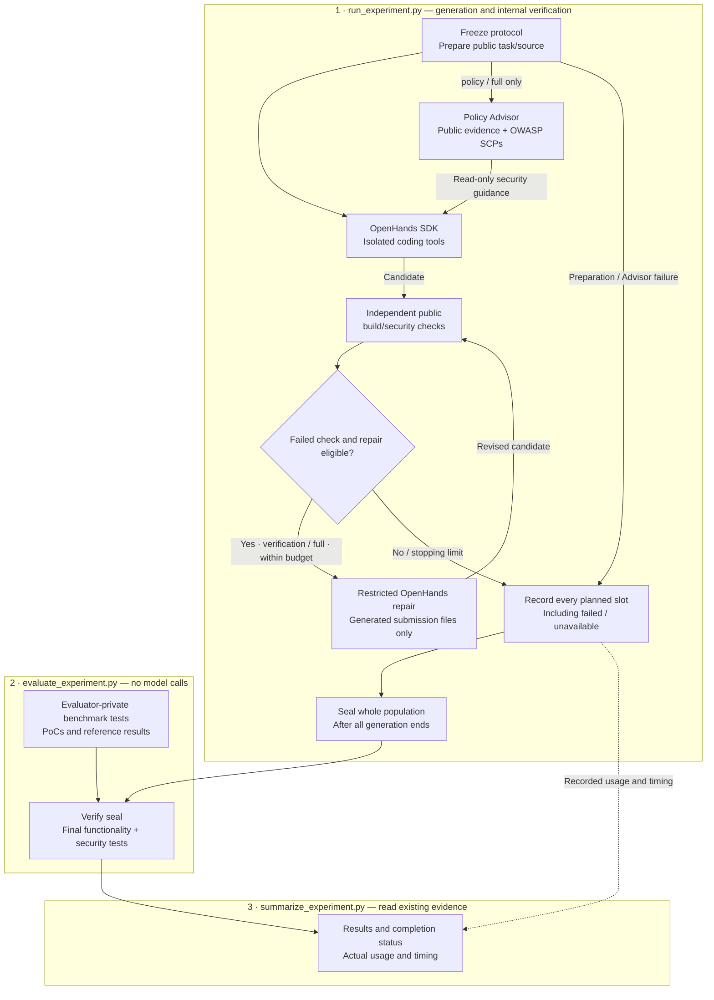

# PECA

A security-focused harness for coding agents, with reproducible experiments.

PECA studies whether secure-coding guidance and independent public verification
improve generated code. It measures functionality, benchmark security outcomes,
agent completion and actual cost separately. SecRepoBench is an evaluation
dataset—not a source of task-specific harness rules or an eligibility filter.

The current repository workflow uses the OpenHands SDK through an isolated shell
adapter. It is not the stock interactive OpenHands CLI.

[Architecture](#harness-architecture) · [Run an experiment](#run-an-experiment) ·
[Runbook](docs/experiment-guide.md) · [Documentation](#documentation)

## Harness architecture



Only public verification can feed the repair loop. Final benchmark evaluation
has **no feedback path** to the agent or Advisor. Unavailable candidates remain
recorded slots; they are not silently dropped or treated as executed tests.

This editable Mermaid diagram describes the implemented repository workflow,
not the roadmap. Update it alongside changes to stages, permissions or data
flows; see the [component map and update checklist](docs/repository-harness.md#maintaining-the-architecture-diagram).

## Run an experiment

### Prerequisites

- Linux or Ubuntu under WSL, Python 3.12+ and a working Docker daemon.
- A host environment with the [Advisor package](policy-advisor-mcp/README.md#install)
  installed; the examples use `.venv/bin/python`.
- A separate Python environment with the compatible OpenHands SDK, supplied with
  `--openhands-python`.
- The pinned SecRepoBench checkout and required agent/ARVO images already present.
  The experiment scripts do not pull images automatically.
- `OPENAI_API_KEY` set securely in the host environment for generation only.
  Do not put credentials in command-line arguments or committed files.

See the [runbook](docs/experiment-guide.md#prerequisites) for setup details.
Run the following commands from the repository root. Replace `TASK_ID` with a
task chosen before observing results and use a new experiment directory.

### 1. Generate and seal

This stage makes real model calls. It freezes the configuration, runs coding and
public-only verification/repair, then seals all planned slots. It does not perform
final benchmark evaluation.

```bash
.venv/bin/python scripts/run_experiment.py \
  --source .artifacts/sources/SecRepoBench \
  --output .artifacts/NEW-EXPERIMENT \
  --tasks TASK_ID \
  --conditions baseline policy verification full \
  --openhands-python /absolute/path/to/openhands-env/bin/python
```

### 2. Evaluate sealed candidates

Run only after generation completes and writes `seal.json`. This stage checks
frozen integrity and runs final benchmark tests, without model calls or repairs.

```bash
.venv/bin/python scripts/evaluate_experiment.py \
  --source .artifacts/sources/SecRepoBench \
  --experiment .artifacts/NEW-EXPERIMENT
```

### 3. Summarize results and efficiency

Run after final evaluation completes. This writes `summary.json` and `summary.md`
without generating code or rerunning tests.

```bash
.venv/bin/python scripts/summarize_experiment.py \
  --experiment .artifacts/NEW-EXPERIMENT
```

Omitting `--tasks` declares **all official tasks** and can incur substantial cost.
Do not run stages concurrently or alter the frozen implementation between
generation and evaluation. Exit `0` means a stage completed its records—not that
every agent or security check succeeded.

See the [runbook](docs/experiment-guide.md) for parameters, outputs, exit codes,
partial reports and interruption handling. To test existing code without models,
use the separate [testbed CLI](docs/secrepobench-testbed.md), not the formal
experiment workflow.

## Four experiment conditions

| Condition ID | Security guidance | External repair using public verification |
| --- | --- | --- |
| `baseline` | None | No |
| `policy` — Advisor-only | Advisor-selected policies | No |
| `verification` | None | Yes, bounded |
| `full` | Advisor-selected policies | Yes, bounded |

Independent public checks are recorded for every candidate; only the repair
conditions feed failures back. Agents may run their own public tests in every
condition. Repair permissions cover only the generated submission target, not
arbitrary dependency or test files. [Budget and scope details](docs/repository-harness.md).

## Fairness and interpretation

- Declare the population before outcomes; retain failed and unavailable slots.
  Do not filter tasks through qualification or add task-specific test fixes.
- Keep benchmark references, PoCs and final results out of generation and repair.
  All planned generations end before final evaluation begins.
- Preserve every attempt. No selective reruns, overwriting results or resuming
  generation after sealing.
- Report actual cost and verification overhead; do not force equal expenditure.
  Missing or checkpoint-only usage is unknown/incomplete, not zero.
- A benchmark pass is not proof of general security. Previously inspected tasks
  are not untouched held-out data; model pretraining contamination is not ruled out.

## Development and current scope

The four-condition repository workflow, generated-file-only repair permissions
and separate evaluation/reporting CLIs are implemented. Sanitizer coverage and
the connection between selected policies and executable checks remain incomplete.
All-SCP and SCP-RAG are planned ablations, not implemented conditions.

Run software checks without model calls or benchmark evaluation:

```bash
.venv/bin/python -m pytest harness/tests policy-advisor-mcp/tests -q
# Include Docker-based synthetic fixtures:
PECA_TEST_DOCKER=1 .venv/bin/python -m pytest harness/tests policy-advisor-mcp/tests -q
```

Maintain the diagram and documentation with the implementation. Keep experiment
evidence under `.artifacts/` (Git-ignored), including failed attempts; do not reuse
retired exploratory results as evidence of effectiveness.

## Documentation

| Need | Start here |
| --- | --- |
| Run or troubleshoot an experiment | [Experiment runbook](docs/experiment-guide.md) |
| Understand isolation, repairs and the architecture | [Repository harness](docs/repository-harness.md) |
| Understand scoring and benchmark limitations | [Benchmark evaluation](docs/benchmark-evaluation.md) |
| Build/test existing code without models | [SecRepoBench testbed](docs/secrepobench-testbed.md) |
| Install or use the independent Policy Advisor | [Advisor MCP](policy-advisor-mcp/README.md) |
| Launch interactive OpenHands outside formal experiments | [Interactive launcher](docs/openhands-launcher.md) |
| Review research design and planned comparisons | [Design protocol](docs/simple-design-experiment.md) · [Ablation plan](ablation-study/PLAN.md) |
| Explore other verifier tasks or optional analysis | [Trusted verifier](harness/README.md) · [AST context](docs/ast-context.md) |
| Check integration status or migrate older setups | [Client integrations](policy-advisor-mcp/integrations/README.md) · [Migration](policy-advisor-mcp/MIGRATION.md) |

The OWASP policy data retains its upstream attribution and license:
[data notice](policy-advisor-mcp/src/policy_selector/data/NOTICE.md).
